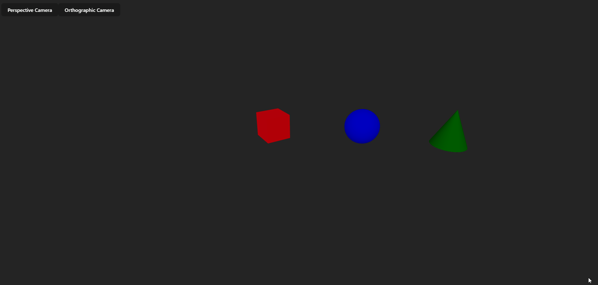
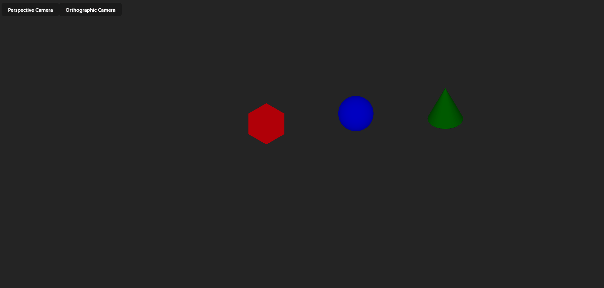
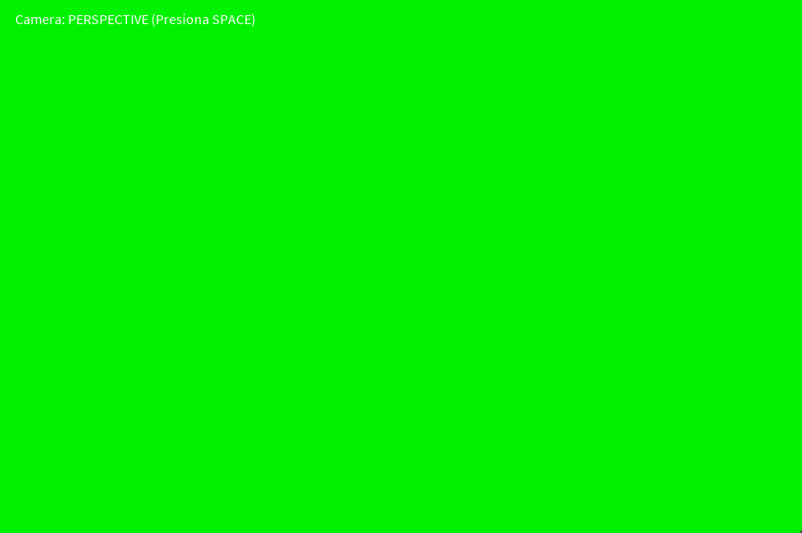
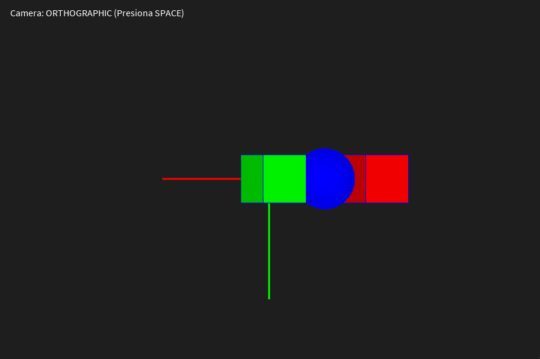

# Taller Espacios Proyectivos Matrices Proyeccion

## Nombres de los Estudiantes

* Alejandro Ortiz Cortes
* John Alejandro Pastor Sandoval
* Nicolas Quezada Mora
* Baruj Vladimir Escalante Ramirez
* Joan Sebastian Puerto Roberto
* Nicolas Rodriguez Piraban

**Fecha de entrega:** 27 de febrero de 2026

---

## Descripción breve

El presente taller tiene como objetivo comprender y aplicar los fundamentos de la geometría proyectiva y el uso de matrices de proyección para representar escenas tridimensionales en un plano bidimensional, concepto esencial dentro del *pipeline gráfico moderno*.

Durante el desarrollo se implementaron diferentes entornos de visualización para analizar cómo funcionan las proyecciones ortogonales y en perspectiva, así como la simulación del comportamiento de una cámara virtual.

Se trabajaron tres implementaciones principales:

* Python (cálculo matemático y visualización)
* Three.js con React Three Fiber (entorno web interactivo)
* Processing (simulación gráfica directa de cámaras)

Cada implementación permitió observar desde distintos enfoques cómo las matrices de proyección transforman la percepción espacial.

---

## Implementaciones

---

### 1. Python

---

### 2. Unity

---

### 3. Three.js + React Three Fiber

**Herramientas utilizadas**

* React
* Three.js
* @react-three/fiber
* @react-three/drei
* OrbitControls

**Descripción**

Se desarrolló una escena 3D interactiva en navegador que simula el comportamiento real de cámaras utilizadas en motores gráficos.

Características implementadas:

* Tres objetos posicionados a distintas profundidades sobre el eje Z.
* Cámara Perspective.
* Cámara Orthographic.
* Botones para cambiar entre cámaras.
* Navegación libre mediante OrbitControls.

El objetivo fue visualizar cómo cambia la percepción espacial al modificar el tipo de proyección.

**Resultados visuales**

Cámara de perspectiva


Cámara ortografica


**Observaciones**

* PerspectiveCamera simula visión humana.
* OrthographicCamera mantiene tamaños constantes.
* OrbitControls permite entender la relación cámara-escena.

---

### 4. Processing (2D/3D)

**Herramientas utilizadas**

* Processing (modo P3D)

**Descripción**

Se creó un entorno 3D básico con objetos distribuidos sobre el eje Z para simular el cambio entre tipos de cámara utilizando:

* `perspective()`
* `ortho()`

El usuario puede alternar dinámicamente entre proyecciones y observar el cambio visual inmediato.

Implementaciones realizadas:

* Sistema de iluminación básica.
* Rotación de escena.
* Representación de ejes cartesianos.
* Cambio de cámara mediante interacción por teclado.

**Resultados visuales**

Cámara de perspectiva


Cámara ortografica


**Observaciones**

* Perspective genera sensación de profundidad.
* Ortho elimina puntos de fuga.
* Se evidencia claramente el concepto de proyección proyectiva.

---

## Código relevante

### Cambio de Cámara en React Three Fiber

```jsx
<OrbitControls />
<PerspectiveCamera makeDefault />
<OrthographicCamera makeDefault />
```

---

### Cambio de Proyección en Processing

```java
if (usarPerspective)
    perspective();
else
    ortho();
```

---

## Prompts utilizados

Durante el desarrollo se empleó IA generativa como apoyo conceptual y estructural.
Principales usos:

* Generación de ejemplos base de escenas 3D.
* Explicación de matrices de proyección.
* Organización del código en distintos entornos gráficos.
* Creación de documentación técnica (README).

Ejemplos de prompts:

* *"Crear escena Three.js con cámara ortográfica y perspectiva"*
* *"Simular proyección perspectiva usando matrices homogéneas en Python"*
* *"Ejemplo Processing con perspective() y ortho()"*

La IA fue utilizada como herramienta de apoyo educativo y no como sustituto del aprendizaje.

---

## Aprendizajes y dificultades

### Aprendizajes

* Comprensión práctica de la geometría proyectiva.
* Uso de coordenadas homogéneas en transformaciones 3D.
* Relación entre matemáticas y motores gráficos reales.
* Funcionamiento interno de cámaras virtuales.
* Diferencias conceptuales entre geometría euclidiana, afín y proyectiva.
* Importancia de las matrices dentro del pipeline gráfico moderno.

Se evidenció que herramientas como Three.js y Processing implementan internamente los mismos conceptos matemáticos desarrollados manualmente en Python.

---

### Dificultades

* Entender inicialmente la normalización por coordenada homogénea `w`.
* Visualizar la diferencia entre profundidad real y percepción visual.
* Ajustar correctamente parámetros como distancia focal y planos de proyección.
* Relacionar la teoría matemática con la implementación gráfica.

Superar estas dificultades permitió comprender cómo un sistema 3D realmente se proyecta sobre una pantalla 2D.

---

## Conclusión

El taller permitió conectar la teoría matemática de espacios proyectivos con su aplicación práctica en gráficos computacionales modernos.
Se comprobó que todas las herramientas gráficas actuales (desde motores web hasta entornos visuales) utilizan exactamente los mismos principios de proyección estudiados, demostrando la relevancia fundamental de las matrices de proyección dentro del desarrollo gráfico contemporáneo.

---
