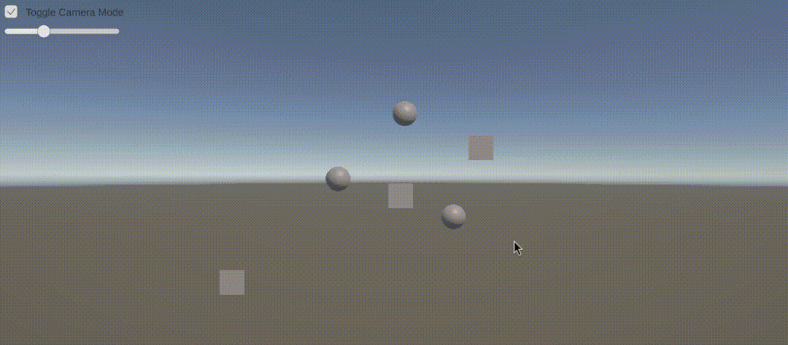
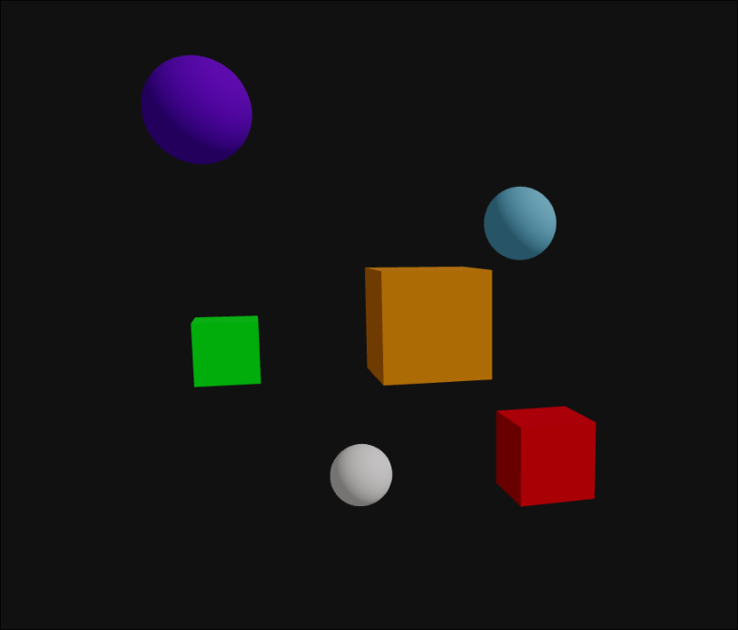
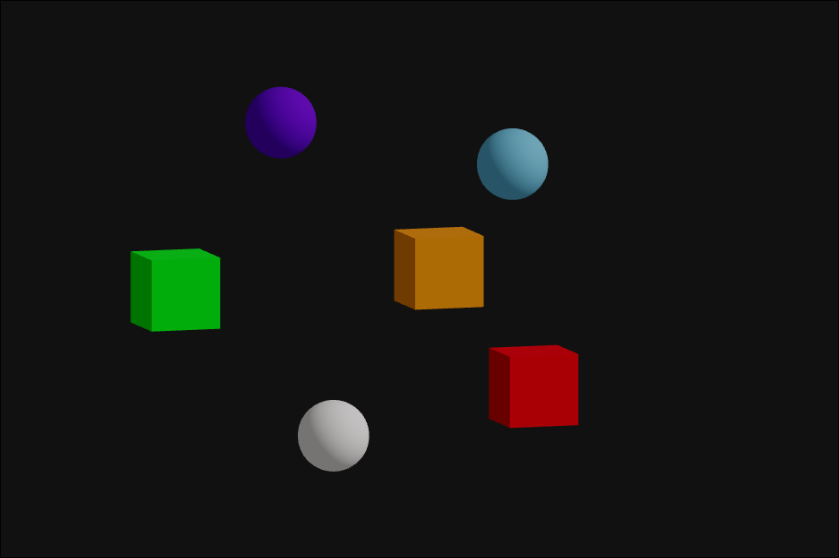

# Proyecciones 3D: Cómo ve una Cámara Virtual

## Nombres de los Estudiantes

* Alejandro Ortiz Cortes
* John Alejandro Pastor Sandoval
* Nicolas Quezada Mora
* Baruj Vladimir Escalante Ramirez
* Joan Sebastian Puerto Roberto
* Nicolas Rodriguez Piraban

## Fecha de entrega

`2026-02-27`

---

## Descripción breve

Este taller explora las diferencias visuales entre las cámaras de perspectiva
y ortográfica en un entorno 3D. Su objetivo es comprender cómo la cámara define
la proyección de una escena tridimensional y cómo cada tipo de cámara influye
en su representación en pantalla.

---

## **Implementaciones:**

* **Unity**: Se implementó una escena con 6 elementos y una cámara. Se desarrolló
un script que permite alternar entre los modos de proyección perspectiva y
ortogiráfica mediante un Toggle. Adicionalmente, cuando la cámara está en modo
ortográfico, se habilita un slider para ajustar el valor de `size` de la cámara.

* **Three.js**: Se implementó una escena compuesta por 6 elementos distribuidos
en diferentes ubicaciones. Se desarrolló un script que permite alternar entre
una cámara de proyección en perspectiva y una cámara de proyección ortográfica
mediante un botón. Adicionalmente, se muestran en pantalla los parámetros
principales de la cámara activa.

---

## **Resultados visuales:**

* **Unity**:


Escena de unity con los elementos y la cámara en formato de perspectiva. El botón
en la parte superior izquierda "Toggle Camera Mode" permite alternar la cámara de
perspectiva a ortográfica.



Escena de unity vista con la cámara en modo ortográfico. El GIF muestra como va
variando la propiedad `size` de la cámara.

* **Three.js**:



Escena en threejs vista desde la cámara de perspectiva. Se observa visualmente una
diferencia entre los objetos cercanos y lejanos.



Escena en trheejs vista desde la cámara ortográfica. Se observa visualmente como
los tamaños de los objetos parecen ser los mismos sin importar la distancia a la
cámrara.


El GIF muestra como se interactua con la escena realizada en threejs. En la parte
superior izquierda se muestra el botón que permite alternar entre los modos
perspectiva y ortográfico de la camára, a la vez que algunas propiedades de la cámara.

---

## **Código relevante:**

* **Unity**:

Alternar Modo de la Cámara

```cs
targetCamera.orthographic = isOrtho;
orthoSizeSlider.gameObject.SetActive(isOrtho);

if (logProjectionMatrix)
    LogProjectionMatrix(); 
```

Mostrar matriz de proyección

```cs
Matrix4x4 m = targetCamera.projectionMatrix;

Debug.Log(
    $"Projection Matrix:\n" +
    $"{m.m00:F3} {m.m01:F3} {m.m02:F3} {m.m03:F3}\n" +
    $"{m.m10:F3} {m.m11:F3} {m.m12:F3} {m.m13:F3}\n" +
    $"{m.m20:F3} {m.m21:F3} {m.m22:F3} {m.m23:F3}\n" +
    $"{m.m30:F3} {m.m31:F3} {m.m32:F3} {m.m33:F3}"
);
```

* **Three.js**:

Usar cámara de perspeciva o ortográfica

```jsx
<button onClick={() => setUsePerspective(v => !v)}>
  Switch Camera
</button>

{usePerspective ? (
  <PerspectiveCamera
    ...
  />
) : (
  <OrthographicCamera
    ...
  />
)}
```

---

## **Prompts utilizados:**

Se utilizó ChatGPT y se utilizaron los siguientes prompts:

```plaintext
crea un scrip en c# para unity que permita controlar el modo de una camara
(perspectiva/ortografica) a traves de un elemento toggle y que cuando este en
modo ortografica permita mostrar un slider que controle el size.

Crea un script para threejs que cree una escena basica con varios elementos
distribuidos. Que use <PerspectiveCamera> y un <OrthographicCamera>, alternables
con un botón. Que utilize OrbitControls para la manipulación de la cámara. Y que
muestre en pantalla textualmente los valores del tipo de camara activa, valores
de fov, aspect, near, far (para perspectiva) y tamaños de left, right, top,
bottom (para ortográfica).
```

---

## **Aprendizajes y dificultades:**

Con la realización de este taller refocé mis conocimiento sobre las diferencias
entre las proyecciones en perspectiva y ortográfica. Además, se entendió como
trabajar con las cámaras en los entornos de unity y threejs. Una dificultad
encontrada en threejs fue como trabajar con la escena y adicionalmente con UI.
La solución para esto fue separar la UI y la escena en diferentes elementos react.

Finalmente, algunas mejoras para futuros proyectos son realizar una mejor interfaz
tanto en threejs y unity, realizar una transición para alterar entre las cámaras,
y añadir más controles para alterar más propiedades de las cámaras en tiempo real.

---

## Contribuciones

Taller Realizado de forma individual. Las implementaciones y documentación fueron
realizados por Nicolas Rodriguez Piraban.

---

## Referencias

* Three.js Documentation: 

---
