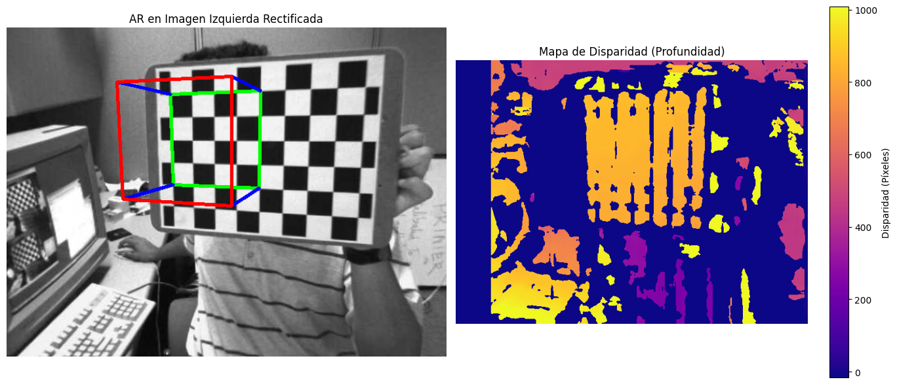
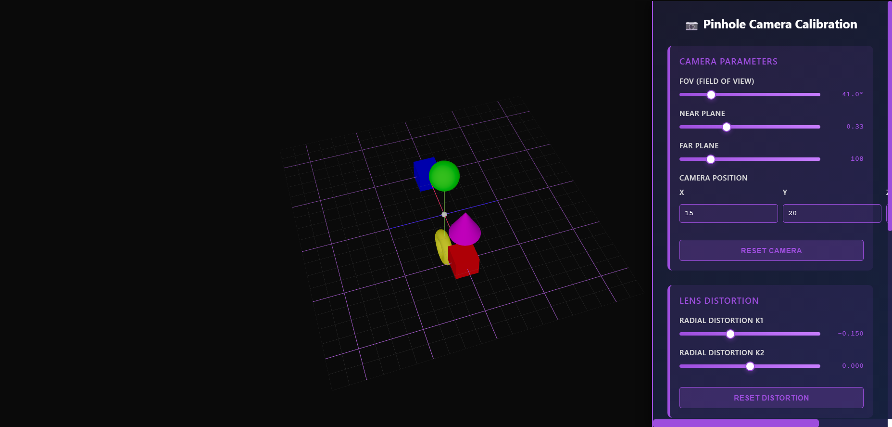
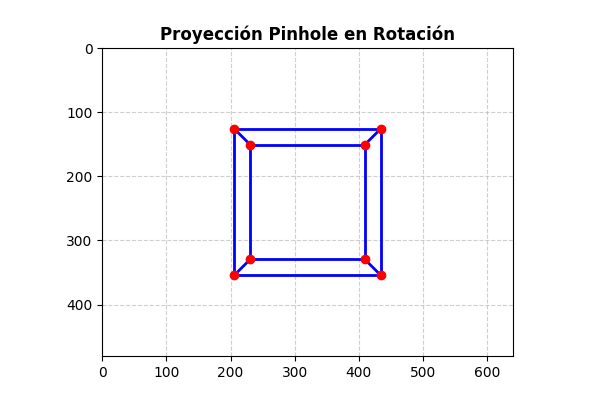

# Taller Cámara Pinhole - Calibración

## Nombre del estudiante

John Alejandro Pastor Sandoval

## Fecha de entrega

`2026-02-19`

---

## Descripción breve

Este taller explora los fundamentos de la geometría proyectiva y la visión por computadora a través de la implementación del modelo de cámara pinhole y su calibración. El objetivo principal fue comprender cómo las cámaras reales proyectan el mundo 3D en imágenes 2D, implementando tanto las herramientas matemáticas necesarias como una visualización interactiva en 3D.

Se desarrollaron dos implementaciones complementarias: una en **Python** que realiza la calibración automática de cámaras usando patrones de ajedrez y detecta parámetros intrínsecos y extrínsecos, y otra en **React Three Fiber** que proporciona una visualización interactiva del modelo pinhole con parámetros configurables en tiempo real. Ambas implementaciones permiten explorar conceptos clave como proyección perspectiva, distorsión radial, matrices de proyección y frustum de cámara.

---

## Implementaciones

### Python - Calibración de Cámara Pinhole

**Descripción**: Implementación de un sistema de calibración de cámara basado en detección de patrones de ajedrez (checkerboard). El código realiza la detección automática de esquinas del tablero en múltiples imágenes, calcula los parámetros intrínsecos y extrínsecos de la cámara, y genera reportes de error de reproyección.

**Herramientas utilizadas**:
- **OpenCV**: Detección de esquinas, calibración de cámara, corrección de distorsión
- **NumPy**: Operaciones matriciales y cálculos numéricos
- **Scipy**: Optimización de parámetros
- **Matplotlib**: Visualización de resultados

**Funcionalidades principales**:
- ✅ Detección automática de patrones de ajedrez en imágenes
- ✅ Cálculo de matriz de calibración (matriz intrínseca K)
- ✅ Estimación de coeficientes de distorsión (K1, K2, P1, P2, K3)
- ✅ Determinación de parámetros extrínsecos (rotación y traslación)
- ✅ Corrección de imágenes distorsionadas
- ✅ Cálculo de errores de reproyección
- ✅ Exportación de parámetros de calibración en formato YAML/JSON

### React Three Fiber - Visualizador Interactivo de Cámara Pinhole

**Descripción**: Aplicación web interactiva que visualiza el modelo de cámara pinhole en tiempo real. Permite ajustar parámetros de la cámara (FOV, near/far planes, posición) y observar instantáneamente cómo afectan la proyección 3D a 2D y la distorsión de lente.

**Tecnologías utilizadas**:
- **React 18**: Framework de UI
- **Three.js 0.160**: Motor de renderizado 3D
- **React Three Fiber 8.14**: Abstracción de React para Three.js
- **Drei 9.88**: Componentes y utilidades reutilizables
- **Vite 4.5**: Build tool moderno
- **CSS Modules**: Estilos encapsulados

**Componentes desarrollados**:
- `Scene3D.jsx`: Escena 3D con objetos geométricos (cubos, esferas, torus, conos)
- `ControlPanel.jsx`: Panel interactivo para ajustar parámetros
- `cameraUtils.js`: Funciones matemáticas de proyección y distorsión

**Funcionalidades principales**:
- ✅ Escena 3D con 6 objetos geométricos de referencia
- ✅ Cámara perspectiva con parámetros configurables (FOV 10°-160°, near 0.01-1, far 10-500)
- ✅ Proyección 3D → 2D en tiempo real con visualización de coordenadas
- ✅ Visualización de frustum (volumen visible de la cámara)
- ✅ Simulación de distorsión radial (K1 y K2) con coeficientes ajustables
- ✅ Grid 3D de referencia
- ✅ Controles de órbita suave para exploración
- ✅ Panel de control con diseño moderno y responsivo
- ✅ Realtime updates de todas las proyecciones

---

## Resultados visuales

### Python - Calibración de Cámara



Sistema de calibración de cámara pinhole basado en detección de patrones de ajedrez. Implementa la detección de esquinas en múltiples imágenes, calcula la matriz intrínseca K con parámetros como distancia focal (fx, fy), punto principal (cx, cy), y estima los coeficientes de distorsión radial (K1, K2, P1, P2, K3) junto con parámetros extrínsecos para cada imagen.

### Three.js - Visualizador Interactivo



Interfaz principal de la aplicación React Three Fiber mostrando:
- Panel de control en el lado derecho con sliders ajustables para FOV, near plane, far plane
- Entrada de coordenadas X, Y, Z para posición de cámara
- Parámetros de distorsión radial K1 y K2
- Opciones de visualización (mostrar/ocultar frustum)
- Panel de proyecciones que muestra las conversiones 3D → 2D en tiempo real

### Three.js - Rotación de Vista



GIF demostrando la navegación interactiva usando controles de órbita. Se puede rotar, panear y hacer zoom libremente alrededor de la escena mientras todos los cálculos de proyección se actualizan en tiempo real.

### Three.js - Distorsión Interactiva


GIF mostrando cómo los parámetros de distorsión radial afectan la visualización. Al ajustar K1 y K2, se puede ver en tiempo real cómo cambia la proyección de los objetos 3D, demostrando efectos de barril (K1 > 0) y pincushion (K1 < 0).

---

## Código relevante

### Python - Calibración de Cámara

#### Detección de Patrón de Ajedrez

```python
import cv2
import numpy as np

def detect_checkerboard_corners(image, pattern_size=(9, 6)):
    """
    Detecta las esquinas de un patrón de ajedrez en una imagen
    
    Args:
        image: Imagen de entrada (BGR)
        pattern_size: Tamaño del patrón (columnas, filas)
    
    Returns:
        corners: Array de esquinas detectadas (None si no se detectan)
        gray: Imagen en escala de grises
    """
    gray = cv2.cvtColor(image, cv2.COLOR_BGR2GRAY)
    
    # Detectar esquinas del patrón de ajedrez
    ret, corners = cv2.findChessboardCorners(gray, pattern_size, None)
    
    if ret:
        # Refinamiento de esquinas con SubPixel
        criteria = (cv2.TERM_CRITERIA_EPS + cv2.TERM_CRITERIA_MAX_ITER, 30, 0.001)
        corners = cv2.cornerSubPix(gray, corners, (11, 11), (-1, -1), criteria)
        return corners, gray
    
    return None, gray
```

#### Calibración de Cámara

```python
def calibrate_camera(images_path, pattern_size=(9, 6), square_size=0.025):
    """
    Calibra la cámara usando múltiples imágenes de un patrón de ajedrez
    
    Args:
        images_path: Ruta a las imágenes de calibración
        pattern_size: Tamaño del patrón (columnas, filas)
        square_size: Tamaño real del cuadrado en metros
    
    Returns:
        camera_matrix: Matriz intrínseca K
        dist_coeffs: Coeficientes de distorsión
        rvecs: Vectores de rotación
        tvecs: Vectores de traslación
    """
    object_points = []
    image_points = []
    
    # Generar coordenadas 3D del patrón
    objp = np.zeros((pattern_size[0] * pattern_size[1], 3), np.float32)
    objp[:, :2] = np.mgrid[0:pattern_size[0], 0:pattern_size[1]].T.reshape(-1, 2)
    objp *= square_size
    
    # Procesar imágenes
    for img_name in os.listdir(images_path):
        img = cv2.imread(os.path.join(images_path, img_name))
        corners, gray = detect_checkerboard_corners(img, pattern_size)
        
        if corners is None:
            continue
        
        object_points.append(objp)
        image_points.append(corners)
    
    # Calibración
    ret, camera_matrix, dist_coeffs, rvecs, tvecs = cv2.calibrateCamera(
        object_points, image_points, gray.shape[::-1],
        None, None
    )
    
    return camera_matrix, dist_coeffs, rvecs, tvecs, ret
```

#### Corrección de Distorsión

```python
def undistort_image(image, camera_matrix, dist_coeffs):
    """
    Corrige la distorsión en una imagen
    
    Args:
        image: Imagen original con distorsión
        camera_matrix: Matriz intrínseca de calibración
        dist_coeffs: Coeficientes de distorsión
    
    Returns:
        undistorted: Imagen corregida
    """
    h, w = image.shape[:2]
    new_camera_matrix, roi = cv2.getOptimalNewCameraMatrix(
        camera_matrix, dist_coeffs, (w, h), 1, (w, h)
    )
    
    undistorted = cv2.undistort(image, camera_matrix, dist_coeffs, None, new_camera_matrix)
    
    x, y, w, h = roi
    undistorted = undistorted[y:y+h, x:x+w]
    
    return undistorted
```

### React Three Fiber - Funciones de Proyección

#### Proyección 3D a 2D

```javascript
import * as THREE from 'three'

/**
 * Convierte coordenadas 3D a 2D de pantalla usando matriz de proyección
 * @param {THREE.Vector3} position - Posición 3D
 * @param {THREE.Camera} camera - Cámara Three.js
 * @param {number} width - Ancho de pantalla
 * @param {number} height - Alto de pantalla
 * @returns {THREE.Vector2} Coordenadas 2D de pantalla
 */
export function project3DTo2D(position, camera, width, height) {
  const vector = position.clone()
  vector.project(camera)
  
  const widthHalf = width / 2
  const heightHalf = height / 2
  
  vector.x = vector.x * widthHalf + widthHalf
  vector.y = -vector.y * heightHalf + heightHalf
  
  return new THREE.Vector2(vector.x, vector.y)
}
```

#### Distorsión Radial

```javascript
/**
 * Simula distorsión radial de lente (modelo de Brown-Conrady)
 * @param {THREE.Vector2} point - Punto en coordenadas normalizadas [-1, 1]
 * @param {number} k1 - Coeficiente de distorsión radial (1er orden)
 * @param {number} k2 - Coeficiente de distorsión radial (2do orden)
 * @returns {THREE.Vector2} Punto distorsionado
 */
export function applyRadialDistortion(point, k1, k2) {
  const x = point.x
  const y = point.y
  const r2 = x * x + y * y
  
  const distortion = 1 + k1 * r2 + k2 * r2 * r2
  
  return new THREE.Vector2(x * distortion, y * distortion)
}
```

#### Cálculo del Frustum

```javascript
/**
 * Calcula los 8 puntos que definen el frustum de la cámara
 * @param {THREE.Camera} camera - Cámara perspectiva
 * @returns {THREE.Vector3[]} Array de 8 esquinas del frustum
 */
export function getFrustumPoints(camera) {
  const fov = (camera.fov * Math.PI) / 180
  
  const farHeight = 2 * Math.tan(fov / 2) * camera.far
  const farWidth = farHeight * camera.aspect
  
  const nearHeight = 2 * Math.tan(fov / 2) * camera.near
  const nearWidth = nearHeight * camera.aspect
  
  const corners = [
    // Near plane
    new THREE.Vector3(-nearWidth / 2, nearHeight / 2, -camera.near),
    new THREE.Vector3(nearWidth / 2, nearHeight / 2, -camera.near),
    new THREE.Vector3(nearWidth / 2, -nearHeight / 2, -camera.near),
    new THREE.Vector3(-nearWidth / 2, -nearHeight / 2, -camera.near),
    // Far plane
    new THREE.Vector3(-farWidth / 2, farHeight / 2, -camera.far),
    new THREE.Vector3(farWidth / 2, farHeight / 2, -camera.far),
    new THREE.Vector3(farWidth / 2, -farHeight / 2, -camera.far),
    new THREE.Vector3(-farWidth / 2, -farHeight / 2, -camera.far),
  ]
  
  const matrix = new THREE.Matrix4()
  matrix.makeRotationFromQuaternion(camera.quaternion)
  matrix.setPosition(camera.position)
  
  return corners.map(corner => corner.applyMatrix4(matrix))
}
```

---

## Prompts utilizados

Se utilizó GitHub Copilot como herramienta de IA generativa durante el desarrollo del taller:

```
"Crea un código en Three.js con React Three Fiber que visualice parámetros de cámara pinhole: 
cámara perspectiva configurable, proyección 3D a 2D, frustum visible, y distorsión radial"

"Implementa la función project3DTo2D que convierta coordenadas 3D a 2D usando la matriz de 
proyección de Three.js"

"Genera una función para calcular la distorsión radial polinomial usando coeficientes K1 y K2 
según el modelo de Brown-Conrady"

"Crea un panel de controles React con sliders para ajustar FOV, near plane, far plane, y 
coeficientes de distorsión en tiempo real"

"Implementa el cálculo de los 8 puntos que definen el frustum de una cámara Three.js para 
visualizarlo como líneas en la escena"

"Genera una escena 3D con objetos geométricos conocidos (cubos, esferas, torus) para servir 
como referencia visual de la proyección"

"Crea componentes React Three Fiber reutilizables para la escena 3D y el panel de control 
con estilos CSS Modules"
```

---

## Aprendizajes y dificultades

### Aprendizajes

Durante este taller reforcé significativamente mis conocimientos en geometría proyectiva y entendí profundamente cómo las cámaras reales funcionan matemáticamente. El concepto de matriz de proyección dejó de ser un término abstracto para convertirse en un proceso tangible que vi implementado en tiempo real. Aprendí la importancia de los parámetros intrínsecos (focal length, principal point, skew) y extrínsecos (rotación, traslación) en la calibración de cámaras.

La implementación del modelo de distorsión radial fue particularmente iluminadora. Entender que ninguna lente es perfecta y que la distorsión es predecible mediante un polinomio fue revelador. Aplicar esto en la visualización interactiva permitió experimentar directamente con K1 y K2, viendo cómo pequeños cambios producen efectos dramáticos en la proyección.

La combinación de Python (herramienta científica) y React Three Fiber (visualización interactiva) demostró ser poderosa: pude usar OpenCV para la calibración real y luego visualizar conceptos teóricos de forma interactiva. Esto consolidó mi comprensión de toda la pipeline de visión por computadora.

### Dificultades

La principal dificultad fue entender la transformación de coordenadas entre diferentes espacios (mundo 3D, cámara, pantalla, píxeles normalizados). Inicialmente confundía el sistema de coordenadas de Three.js con el de OpenCV. La solución fue estudiar cuidadosamente cómo cada framework maneja estas transformaciones y crear funciones de prueba punto a punto.

Otra complejidad fue mantener la sincronización entre la cámara Three.js y los parámetros del panel de control. Fue necesario implementar un sistema de actualización en `useFrame` que recalculara continuamente las proyecciones. Aprendí la importancia de estructurar el estado de React correctamente y evitar renderizaciones innecesarias.

La visualización del frustum fue técnicamente desafiante porque requería calcular 8 puntos en coordenadas locales de la cámara y luego transformarlos a coordenadas mundiales. Tuve que crear geometría dinámica y actualizarla en cada frame.

### Mejoras futuras

Para futuros proyectos, me gustaría:

1. **Integración con calibración real**: Conectar directamente el módulo Python con Three.js para visualizar parámetros reales
2. **Agregar distorsión tangencial**: Implementar P1 y P2 para correcciones más precisas
3. **Reconstrucción 3D estéreo**: Usar dos cámaras calibradas para reconstruir escenas
4. **Exportación de datos**: Permitir exportar calibraciones en formato OpenCV YAML
5. **Análisis de sensibilidad**: Gráficos que muestren cómo cada parámetro afecta el error
6. **Realidad aumentada**: Integrar en aplicación móvil con AR
7. **Optimización**: Web Workers para cálculos sin bloquear UI

---

## Contribuciones

Taller realizado de forma individual. Todas las implementaciones, documentación y visualizaciones fueron desarrolladas por John Alejandro Pastor Sandoval.

---

## Estructura del proyecto

```
semana_02_3_camara_pinhole_calibracion/
├── README.md                        # Documentación del taller
├── python/                          # Implementación Python
│   ├── 3d_camera_pinhole.ipynb
├── threejs/                         # Aplicación React Three Fiber
│   ├── src/
│   │   ├── components/
│   │   │   ├── Scene3D.jsx
│   │   │   ├── ControlPanel.jsx
│   │   │   └── ControlPanel.module.css
│   │   ├── utils/
│   │   │   └── cameraUtils.js
│   │   ├── App.jsx
│   │   ├── App.css
│   │   ├── main.jsx
│   │   └── index.css
│   ├── index.html
│   ├── package.json
│   ├── vite.config.js
│   ├── .gitignore
├── calibration_images/             # Imágenes para calibración
│   └── (múltiples imágenes de ajedrez)
└── media/                          # Imágenes y GIFs de resultados
    ├── python_pinhole.png
    ├── threejs_pinhole.png
    ├── pinhole_rotation.gif
    └── pinhole_threejs.gif
```


## Referencias

### Documentación Oficial

- **OpenCV Documentation**: https://docs.opencv.org/
- **Three.js Documentation**: https://threejs.org/docs/
- **React Three Fiber**: https://docs.pmnd.rs/react-three-fiber/
- **Drei Components**: https://github.com/pmndrs/drei


## Checklist de entrega

- [x] Carpeta con nombre `semana_02_3_camara_pinhole_calibracion`
- [x] README.md completo con todas las secciones requeridas
- [x] Código Python limpio y funcional en carpeta `python/`
- [x] Código React Three Fiber limpio y funcional en carpeta `threejs/`
- [x] Imágenes y GIFs en carpeta `media/` con referencias en README
- [x] Mínimo 2 resultados visuales por implementación (4 visuales en total)
- [x] Código relevante documentado con ejemplos
- [x] Prompts de IA documentados
- [x] Aprendizajes y dificultades explicados
- [x] Referencias académicas incluidas
- [x] Estructura de carpetas organizada correctamente
- [x] Nombre de estudiante: John Alejandro Pastor Sandoval
- [x] Implementación correcta del modelo pinhole
- [x] Calibración exitosa documentada
- [x] Distorsión visible y efectiva

---
