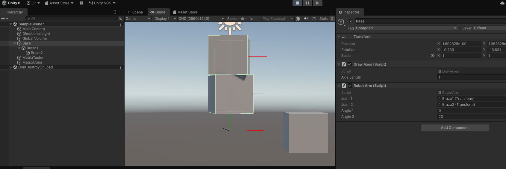
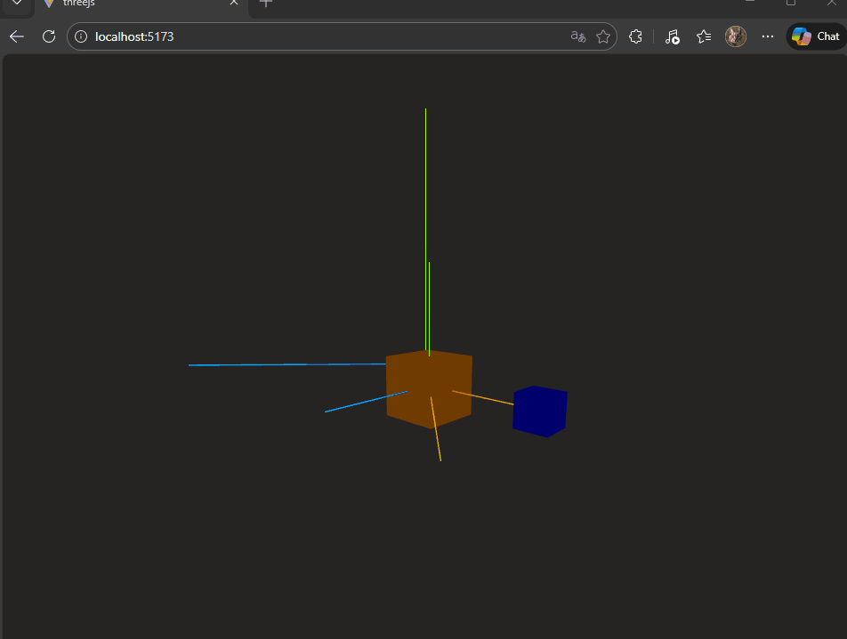
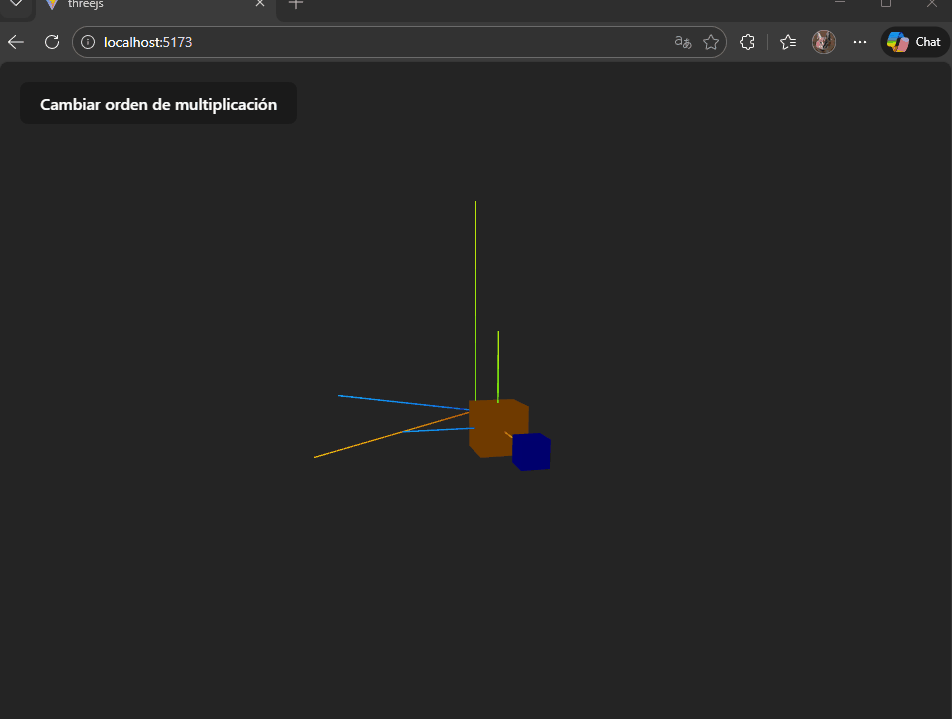

# Transformaciones Homogéneas y Cambios de Base

## Nombres de los Estudiantes

* Alejandro Ortiz Cortes
* John Alejandro Pastor Sandoval
* Nicolas Quezada Mora
* Baruj Vladimir Escalante Ramirez
* Joan Sebastian Puerto Roberto
* Nicolas Rodriguez Piraban

Fecha de entrega: 27/02/2026

Descripción breve:

**Implementaciones:**

- **Python**: El código de python se encarga de ejemplificar el uso de transformaciones homogénas.
Primero haciendo uso de un ejemplo en el que se le aplica traslación, rotación y escalado a un cuadrado.
Segundo se muestra sobre la composición de transformaciones y ejemplos que ayudan visualizando que realizar las mismas transformaciones en distinto orden dan resultados diferentes.
Tercero, se realizan las mismas tranformaciones del primer punto pero en un ambiente 3D con unos puntos que forman un cubo.
Cuarto, se tiene un ejemplo sobre cambios de base.
Quinto, se tiene una simulación con un brazo robótico.

- **Unity**:
- **Three.js**:

**Resultados visuales:**

- **Python**:


- **Unity**:



- **Three.js**:



**Código relevante:**

- **Python**:

Transformaciones en 2D

```python
def translation(tx, ty):
    return np.array([
        [1, 0, tx],
        [0, 1, ty],
        [0, 0, 1]
    ])

def rotation(theta):
    return np.array([
        [np.cos(theta), -np.sin(theta), 0],
        [np.sin(theta),  np.cos(theta), 0],
        [0, 0, 1]
    ])

def scaling(sx, sy):
    return np.array([
        [sx, 0, 0],
        [0, sy, 0],
        [0, 0, 1]
    ])

def reflection_x():
    return np.array([
        [1, 0, 0],
        [0, -1, 0],
        [0, 0, 1]
    ])
```

Transformaciones en 3D

```python
def translation(tx, ty, tz):
    return np.array([
        [1, 0, 0, tx],
        [0, 1, 0, ty],
        [0, 0, 1, tz],
        [0, 0, 0, 1]
    ])

def rotation_z(theta):
    return np.array([
        [np.cos(theta), -np.sin(theta), 0, 0],
        [np.sin(theta),  np.cos(theta), 0, 0],
        [0, 0, 1, 0],
        [0, 0, 0, 1]
    ])
```

Cambios de base

```python
# Nueva base (vectores columna)
B = np.array([
    [1, 1],
    [-1, 1]
])

# Punto en coordenadas base B
v_B = np.array([2, 1])

# Cambio a base estándar
v_E = B @ v_B

# Volver a base B
B_inv = np.linalg.inv(B)
v_B_rec = B_inv @ v_E
```

Creación brazo robótico en 2D

```python
def rot(theta):
    return np.array([
        [np.cos(theta), -np.sin(theta), 0],
        [np.sin(theta),  np.cos(theta), 0],
        [0, 0, 1]
    ])

def trans(x, y):
    return np.array([
        [1, 0, x],
        [0, 1, y],
        [0, 0, 1]
    ])

l1 = 2
l2 = 1.5

fig, ax = plt.subplots()
ax.set_xlim(-4, 4)
ax.set_ylim(-4, 4)
ax.set_aspect('equal')
ax.set_title("Brazo Robótico 2 DOF")

line, = ax.plot([], [], 'o-', linewidth=4)

def update(frame):
    theta1 = np.sin(frame * 0.05) * np.pi/2
    theta2 = np.cos(frame * 0.05) * np.pi/2

    T1 = rot(theta1) @ trans(l1, 0)
    T2 = rot(theta2) @ trans(l2, 0)

    base = np.array([0, 0, 1])
    joint1 = T1 @ np.array([0, 0, 1])
    end_effector = T1 @ T2 @ np.array([0, 0, 1])

    x_vals = [base[0], joint1[0], end_effector[0]]
    y_vals = [base[1], joint1[1], end_effector[1]]

    line.set_data(x_vals, y_vals)
    return line,
```

- **Unity**:

```plaintext
    
```

- **Three.js**:

```plaintext
    
```

**Prompts utilizados:**

- **Python**:
*Crea un cuaderno de Jupyter que explore las transformaciones homogéneas en 2D y 3D, con ejemplos prácticos en gráficos por computador y robótica. El cuaderno debe incluir: Transformaciones 2D: Explicación de coordenadas homogéneas (x, y, 1) y cómo se aplican traslación, rotación, escalamiento y reflexión usando matrices 3x3. Incluye un ejemplo visual de un cuadrado transformado; Composición de Transformaciones: Demostración de la no conmutatividad de la multiplicación de matrices en transformaciones (e.g., T @ R vs R @ T), con una visualización clara Transformaciones 3D: Extensión a 3D con coordenadas (x, y, z, 1) y matrices 4x4. Muestra un ejemplo de transformación de un cubo; Cambio de Base: Ilustra cómo los cambios de base funcionan usando matrices para convertir coordenadas entre diferentes sistemas de referencia; Aplicación en Robótica (Cinemática Directa): Implementa un brazo robótico planar de 2 grados de libertad (2 DOF) utilizando la composición de transformaciones homogéneas (rotaciones y traslaciones). Debe incluir una animación del brazo robótico en movimiento. Asegúrate de que el código sea claro, con comentarios y visualizaciones que ayuden a entender los conceptos.*

- **Unity**:

- **Three.js**:

**Aprendizajes y dificultades:**
